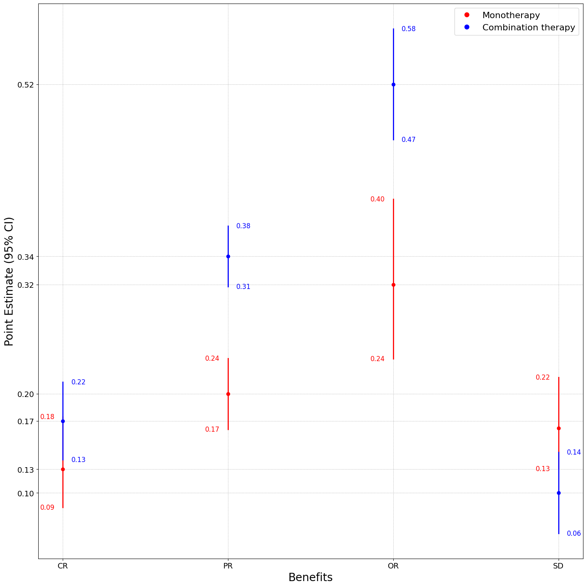

# Visualization of Patient Risk–Benefit Space

This Jupyter notebook allows you to visualize **risk, benefit, or adverse events data** for **monotherapy** and **combination therapy** using **forest plots**.  


## Purpose
- Display point estimates with 95% confidence intervals for each therapy group.  
- Compare different therapies across multiple benefits or adverse events.  
- Provide a flexible and interactive way to explore your dataset.  


## Input Data
- Excel file with two sheets for therapy groups (names can be adjusted):  
  - One sheet for **monotherapy** (e.g., `"Benefit mono"`)  
  - One sheet for **combination therapy** (e.g., `"Benefit combo"`)  

- Each sheet must contain at least the following columns:  
  - First column: x-axis labels (either Benefits or Adverse Events or Risks)  
  - `point estimate` → y-axis value  
  - `95% CI-left` and `95% CI-right` → 95% confidence intervals  
  - Other columns (e.g., number of studies, patients, I-square, model) are optional.  


## Instructions
1. Update the `file_path` variable to point to your Excel file.  
2. Adjust sheet names in `therapy_sheets` if needed.  
3. Run all cells in the notebook to generate the forest plot.  
4. Optionally, uncomment the `plt.savefig` line to save the figure as a PNG file.  


## Notes
- The x-axis is automatically set based on the first column of each sheet.  
- Colors indicate therapy groups:  
  - 🔴 Red = Monotherapy  
  - 🔵 Blue = Combination therapy  
- Optional y-tick removal is included to avoid overlapping labels (e.g., `"SD"` as Stable Disease).  
  Adjust or remove this option depending on your dataset.  
  
## Example

*Figure 1. Example forest plot generated from sample data (monotherapy vs combination therapy).*


## Acknowledgment
This research was funded by the Science Fund of the Republic of Serbia through the project “Optimization and Prediction in Therapy Treatments of Cancer—OPTIC” (PROMIS Program for Excellent Projects of Young Researchers).
 


```python

```
